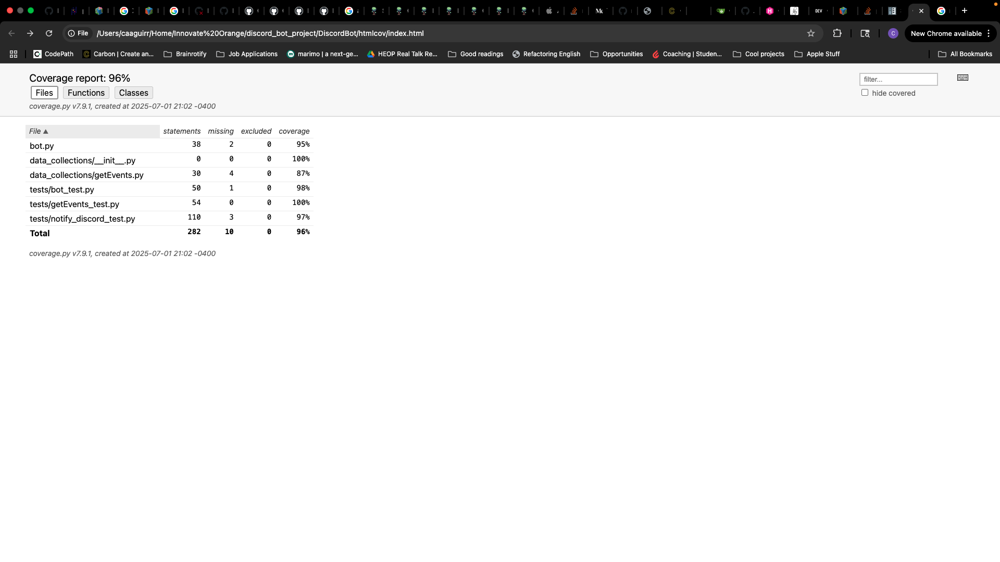
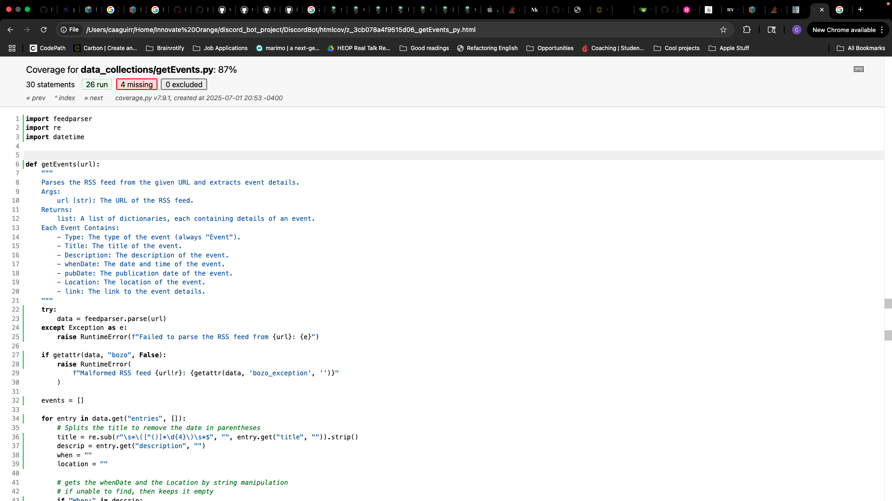
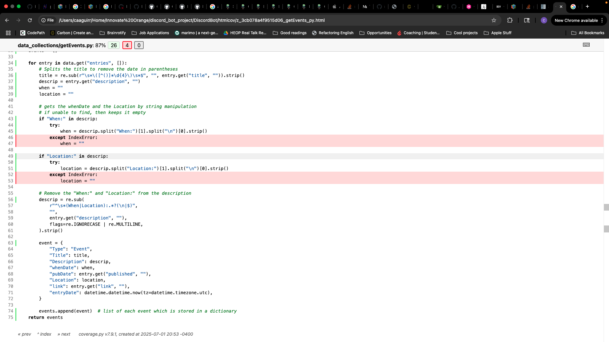
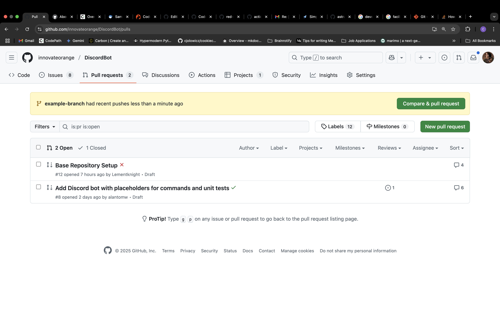
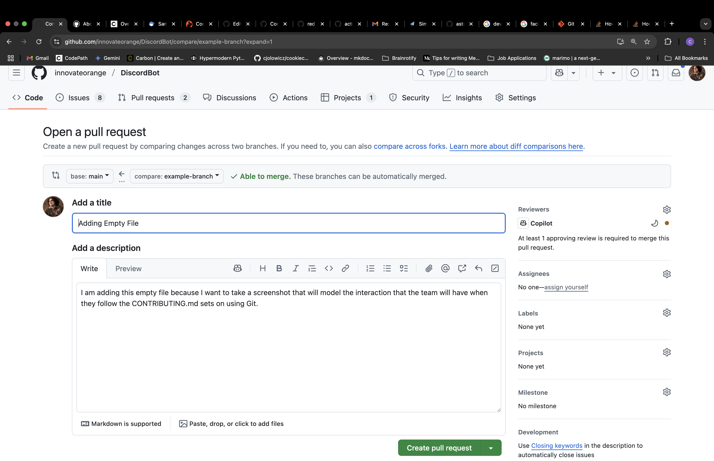
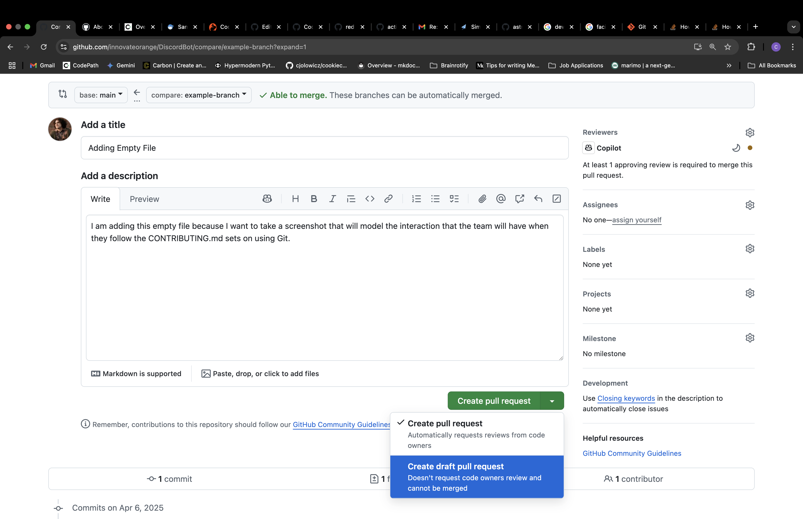
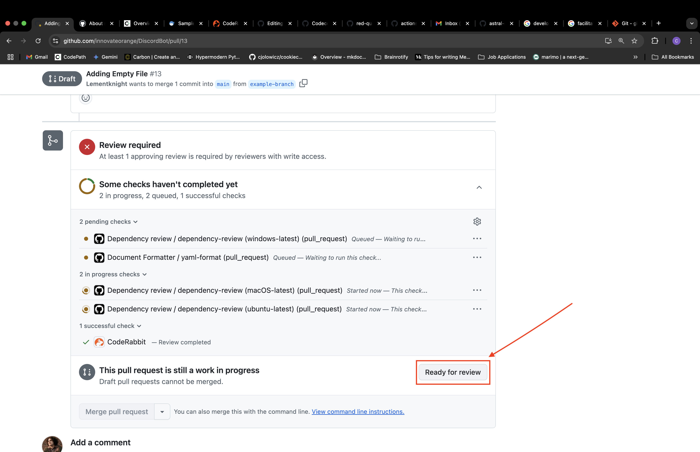

<!-- CONTRIBUTING.md is based on the provided in the Red Queen Repo: https://github.com/Qiskit/red-queen/blob/a9f396b16c88cea9c9987cd379526c0624e22323/CONTRIBUTING.md -->

# Contributing

First read the overall project contributing guidelines. These are all
included in the ReadMe file of this repo:

<https://github.com/innovateorange/DiscordBot/blob/ec161ab7b4d38fab5db17f62c353e9d673e6fbde/README.md>

## Contributing to Discord Bot Project

### Style and lint

Discord Bot Project uses two tools to verify code formatting and lint checking. The
first tool is [black](https://github.com/psf/black) which is a code formatting
tool that will automatically update the code formatting to a consistent style.
The second tool is [ruff](https://github.com/astral-sh/ruff) which is a code linter
which does a deeper analysis of the Python code to find both style issues and
potential bugs and other common issues in Python.

You can check that your local modifications conform to the style rules
by running `nox` which will run `black` and `ruff` to check the local
code formatting and lint. You will need to have [nox](https://github.com/wntrblm/nox)
installed to run this command. You can do this with `pip install -U nox`.

>[!NOTE]
>If black returns a code formatting error, you can run `nox -s format` to
automatically update the code formatting to conform to the style. However,
if `ruff` returns any error, you will have to resolve these issues by manually updating your code.

### Creating a new issue

This is where contributions begin within our project.

We use custom issue templates to streamline how you report bugs, suggest new features, or track tasks. To create an issue within the repository:

1. Navigate to the main page of the repository.
2. Under the repository name, click **Issues**.

3. Click **New Issue**

4. Choose an issue template that is relevant to the task you are creating based on the following:


- **Bug Report**

  Use this template if something isn't working as expected. You'll be prompted to
  - Describe what happened and what you expected.
  - Outline the steps to reproduce the issue.
  - Optionally attach screenshots or logs.
- **Feature Request**

  Use this when suggesting a new idea or improvement. You'll be asked to:
  - Describe the feature and its purpose.
  - Explain the motivation or problem it solves.
  - Suggest possible alternatives or solutions.

> [!NOTE]
> For all other issue types (e.g., documentation, research, workflows), please fill out a blank issue stating the information needed to resolve the task.

These templates ensure that issues are organized and easier for maintainers to address. Please fill them out thoroughly!

### Setting up your virtual environment (.venv)

Working on Python projects, it's generally a good idea to use virtual environments to prevent library conflicts. Here's how you can set up a virtual environment for this project:

**On macOS/Linux:**

1. **Run the setup script**  
    Navigate to the project directory and execute the `setup.sh` script to create and configure the virtual environment:

    ```bash
    ./setup.sh
    ```

    This script automates the creation, activation, and dependency installation.

2. **Activate manually (if needed)**

    ```bash
    source .virtualenv/bin/activate
    ```

**On Windows:**

1. **Create the virtual environment**  
    Open Command Prompt or PowerShell, navigate to the project directory, and run:

    ```powershell
    python -m venv .virtualenv
    ```

2. **Activate the virtual environment**

    ```powershell
    .\.virtualenv\Scripts\activate
    ```

3. **Upgrade `pip` and install dependencies**  
    Once activated, run:

    ```powershell
    python -m pip install --upgrade pip
    pip install -r requirements.txt
    ```

`
**Deactivating (All Platforms):**

When you're done working, deactivate the virtual environment by running:

```bash
deactivate
```

> [!NOTE]
> Make sure to activate the virtual environment every time you work on the project to ensure you're using the correct dependencies.

This setup ensures that your development environment is isolated and consistent with the project's requirements.

### Branch Naming Conventions

Before creating a new branch, please review this section to follow the repository's branch-naming conventions.

Consistent branch naming provides clarity and makes it easier to locate specific branches related to ongoing work.

> [!NOTE]
> All documentation for this section was adapted from [Medium](https://medium.com/@abhay.pixolo/naming-conventions-for-git-branches-a-cheatsheet-8549feca2534)

**Basic Rules**:

1. **Lowercase and Hyphen-separated**: Stick to lowercase for branch names and use hyphens to separate words—for example, `feature/new-login` or `bugfix/header-styling`.
2. **Alphanumeric Characters**: Use only alphanumeric characters (a-z, A-Z, 0–9) and hyphens. Avoid punctuation, spaces, underscores, or any non-alphanumeric character.
3. **No Continuous Hyphens**: Do not use continuous hyphens. `feature--new-login` can be confusing and hard to read.
4. **No Trailing Hyphens**: Do not end your branch name with a hyphen. For example, `feature-new-login-` is not a good practice.
5. **Descriptive**: The name should be descriptive and concise, ideally reflecting the work done on the branch.

**Branch Prefixes**:
Using branch names helps to quickly identify the purpose of the branches. Here are some common types of branches with their corresponding prefixes:

1. **Feature Branches**: Used for developing new features. Use the prefix `feature/` (e.g., `feature/login-system`).
2. **Bugfix Branches**: Used to fix bugs in the code. Use the prefix `bugfix/` (e.g., `bugfix/header-styling`).
3. **Hotfix Branches**: Created directly from the production branch to fix critical bugs. Use the prefix `hotfix/` (e.g., `hotfix/critical-security-issue`).
4. **Release Branches**: Used to prepare for a new production release. Use the prefix `release/` (e.g., `release/v1.0.1`).
5. **Documentation Branches**: Used to write, update, or fix documentation (e.g., the `README.md`). Use the prefix `docs/` (e.g., `docs/api-endpoints`).

### Creating a new branch

When you want to contribute to the Discord Bot Project, you will need to create a new branch where you will be staging your changes.

You can do this by running the git checkout command:

```bash
git checkout -b <new_branch_name>
```

> [!CAUTION]
> Note that this command creates a branch based on the branch you are currently in, so ensure you are on the `stage` branch before creating a new branch. Checking out from any branch other than `stage` risks a failed deployment.

> [!NOTE]
> You can see which branch you are on by using the git branch command:
>
> ```bash
> git branch
> ```
>
> If you are on a different branch other than stage when creating your feature branch, ensure you run the following commands
>
> ```bash
> git checkout stage
> git pull
> git checkout -b <new_branch_name>
> ```

### Migrating Environments

We have deployment environments to ensure that we are not deploying unfinished or buggy code to users! Our branch merges are directly tied to the environments your code will run in. Here’s how it works:

```text
[Branch]
feature branch -> stage -> release branch -> main

[Environments]
Development -> Staging -> Production
```

- **feature branch**: Code here is considered part of the **Development** environment. This is where you work on new features or fixes.
- **stage**: When you merge your feature branch into `stage`, your code moves to the **Staging** environment. This is for testing and validation before release.
- **release branch**: Merging from `stage` to a `release branch` prepares your code for deployment to **Production**.
- **main**: Once your release branch is merged into `main`, your code is officially live in the **Production** environment.

#### Step-By-Step Migration
In this section you will learn how to get your code from `Development` to `Production`

1. **Create a branch from main**
     
    run the following commands
    ```bash
    git checkout main
    git pull origin main
    git checkout -b <branch-name>
    ```
    > [!NOTE]
    >
    > Please check out the [Branch Naming Convention](https://github.com/innovateorange/DiscordBot/blob/main/CONTRIBUTING.md#branch-naming-conventions) section of this document to understand how to name your branches
2. **Push your changes to remote**
3. **Validate your changes in Development**

    > [!NOTE]
    >
    > Please check out the [Validating Changes to the Bot Locally](https://github.com/innovateorange/DiscordBot/blob/main/CONTRIBUTING.md#validating-changes-to-the-bot-locally) section of this document if you need to run and test / validate your changes to the bot locally
4. **Merge branch into `stage`**

   > [!IMPORTANT]
   >
   > Do **NOT** create a pull request yet. Only proceed with the following commands **after you have validated your changes in the `Development` environment**
   ```bash
   git checkout stage
   git pull origin stage
   git merge <branch-name>
   ```

   > [!NOTE]
   > Your changes aren't in `Staging` right of way. CI/CD Jobs will create a deployment job that needs to be reviewed by your Project Manager / Team Lead first
5. **Validate your changes in `Staging`**
   
   > [!NOTE]
   >
   > Please check out the [Validating Changes in Staging](https://github.com/innovateorange/DiscordBot/blob/main/CONTRIBUTING.md#validating-changes-in-staging) section of this document especially if you need to run and test / validate your changes to the bot within the Staging Environment
6. **

  

### Testing Your Code With Unittests

Once you have made changes to the code, it's essential to test your modifications to ensure they work as expected. The Discord Bot Project uses `unittest` for testing. Here's how to run the tests:

1. Use the following command to run all tests:

   ```bash
   nox -s tests
   ```

A successful run will look something like this:

```bash
nox > Running session tests
nox > Creating virtual environment (virtualenv) using python3.13 in .nox/tests
nox > python -m pip install -r requirements.txt
nox > python -m pip install 'coverage[toml]'
nox > coverage run -m unittest discover -s tests -p '*_test.py'
nox > coverage report --fail-under=90
----------------------------------------------------------------------
Ran 30 tests in 0.029s

OK
Invalid token provided. Please check your .env file.
environment file does not found
Name                            Stmts   Miss  Cover
---------------------------------------------------
bot.py                             38      2    95%
data_collections/__init__.py        0      0   100%
data_collections/events.py         30      4    87%
tests/bot_test.py                  50      1    98%
tests/events_test.py               54      0   100%
tests/notify_discord_test.py      110      3    97%
---------------------------------------------------
TOTAL                             282     10    96%
Wrote XML report to coverage.xml
Wrote HTML report to htmlcov/index.html

```

> **WARNING**
> Ensure that every test file follows the `<module>_test.py` pattern, where `<module>` is the file under test.
> For example, tests for `events.py` belong in `events_test.py`. The test-discovery mechanism recognises only files that match this pattern.

> [!NOTE]
> We used nox to run our tests so if you want to understand what nox is doing, you can check out the [`noxfile.py`](https://github.com/innovateorange/DiscordBot/blob/1ca27875bd65239f4a7a8d9da645363908a99c2e/noxfile.py) in the root directory of the project. It contains all the commands that nox will run when you execute it.

If your tests fail, then it can be due to three main reasons:

- Syntax errors
  - This means that there is a syntax error in your code that is preventing the tests from running. You can fix this by checking the error message and fixing the syntax error in your code.
- Logic errors
  - This means that there is a logic error in your code that is causing the tests to fail. You can fix this by checking the error message and fixing the logic error in your code.
- Lack of coverage
  - This means that your code does not have enough test coverage. You can fix this by adding more tests to your code. The coverage report will show you which lines of code are not covered by tests.

> [!TIP]
> When you run the tests, you will see a HTML coverage report generated in the `htmlcov` directory. Open the `index.html` file in your web browser to view the coverage report. This report will show you which lines of code are covered by tests and which lines are not. You can use this report to identify areas of your code that need more testing.
>
>Here's what it looks like when you open the `index.html` file in your web browser:
>
>
>

> **Warning:**
> If your `index.html` file doesn't contain every python file in the project barring `notify_discord.py`, then you can run the following command to generate a new coverage report:
>
> ```bash
> coverage html
> ```

Great you've seen the coverage report and have identified areas for improvement! Here are instructions for testing the bot.

### Validating Changes to the Bot Locally

#### Validate in Development BEFORE pushing to stage

We use separate Discord bots for each environment:  

- **Development Bot** (`Bug [Development]`)
- **Staging Bot** (`Bug [Staging]`)
- **Production Bot** (`Bug [Production]`)

When testing changes make sure you are using the correct `DISCORD_BOT_TOKEN` for the **Development** environment. There will be multiple development bot tokens and bots available so several contributors can test their code simultaneously.

Here's how to validate your changes locally:

1. Install dependencies:

  ```bash
  pip install -r requirements.txt
  ```

2. Create a `.env` file in the root directory with your **development** bot token (see BitWarden for credentials):

  ```env
  DISCORD_TOKEN=your_development_bot_token_here
  ```

3. Run the bot:

  ```bash
  python bot.py
  ```

The bot will connect to Discord using the development token. Test all modified or new functionality in the **Development** environment before pushing to `stage`.

> [!NOTE]
> Never commit your bot token to the repository. The `.env` file is included in `.gitignore` for security.

Once you are ready to push your code to the branch you created, stage your changes as described below.

### Staging your changes

First you need to add all your changes (deltas) to a git. [You can think of this as putting all of your work into an unmarked folder]

```bash
git add -A # This adds all of the files/edits that you have made 
```

After you add your changes to git, you need to sign it with a message [You can think of this as signing the folder with your name so we know whose work is in the folder]:

```bash
git commit -am "<Title of Change>\n <Rationale behind change>" # This command signs your changes
```

> [!TIP] You can think of your commit message as an email where you explain to your team the reasoning behind your changes. You don't need to explain you changes, your deltas are visable for any reviewers. The thought behind your changes should be clearly outlined in your commit.

After you sign your changes, you need to push your changes to your branch's upstream:

For first-time commits to branch:

```bash
git push -u # This command creates an upstream version of your local branch 
```

>[!NOTE]
> The -u flag is important to track the initial tracking history of the branch itself. You're basically telling git: "Hey, from now on, whenever I'm on this branch, I want to link it to this branch on GitHub." Almost like saving contact information on your phone

For subsequent commits to branch:

```bash
git pull # Pulls changes from base repository 
git push # Pushes changes to upstream
```

### Creating a Pull Request Draft

Once you have established a upstream tracking for your the branch, navigate to the GitHub repository's `Pull requests` section. You should see a button that says `Compare & pull request`.

It should look similar to this:



Press the `Compare & pull request` button, then you will be given the option to create a pull request in this screen:



Click the dropdown menu of the `Create pull request` button:



And then create a draft pull request. Now you can see if your changes pass the [CI/CD](https://github.com/innovateorange/DiscordBot/actions) checks. From here you can work on your changes until it is ready for review.

Before submitting your code for review, please ensure that you have completed the following:

- [ ] Ensure that your code passes all of the [CI/CD](https://github.com/innovateorange/DiscordBot/actions) checks
- [ ] You have added tests for any new features
- [ ] You have added documentation for any new features
- [ ] You have added a description of the changes you made in the pull request

> [!NOTE]
> If your pull request is missing any of the above, it will be converted back to a draft and will not be reviewed until the above conditions are met. This is to ensure we are following best practices for industry-ready code.

Once you have ensured that you have done all of the above, you can convert your draft to a pull request for review. You can do this by pressing the `Ready for review` button:



Once you do that, you are ready for code review!

### Validating Changes in Staging

Once your changes have passed local testing and are ready for broader validation, they should be tested in the **Staging** environment. The Discord Bot is deployed on our GCP LM, and the staging bot mirrors the production setup as closely as possible.

>[!WARNING]  
> After your code is merged into the `stage` branch, you should **not** run the bot locally. All testing at this point must be performed using the staging bot instance.

#### How to Test in Staging

1. **Push your branch to `stage`:**  
  Merge your feature branch into the `stage` branch following the standard workflow.

2. **Deployment:**  
  The bot will be automatically deployed to the Staging environment via our CI/CD pipeline.

3. **Testing:**  

- Interact with the staging bot (`Bug [Staging]`) in Discord.
- Validate all new features, bug fixes, and changes in the staging environment.
- Confirm that your changes work as expected and do not introduce regressions.

4. **Reporting Issues:**  
  If you encounter any problems, create an issue in the repository and assign it the appropriate template.

> [!NOTE]
> The staging bot uses a separate Discord token and configuration from development and production. Ensure you are testing with the correct bot in the correct environment.

**Summary:**  
All code merged into `stage` must be tested exclusively through the staging bot. This ensures that your changes are validated in an environment that closely matches production, reducing the risk of deployment issues.

### Validating Changes in Production

Once your changes have passed all tests and reviews in the staging environment, they are ready to be considered for deployment to production. The process for migrating changes to production is managed by the project managers, who handle release branches by copying the `stage` branch and removing any unsuccessful commits before deploying.

- **Deployment:**  
  Project managers will create the release branch by copying the current `stage` branch and removing any commits that did not pass validation. After this, the production bot will be automatically deployed via our CI/CD pipeline.

- **Testing:**  
  Interact with the production bot (`Bug [Production]`) in Discord to verify that all new features, bug fixes, and updates are functioning as expected in the live environment.

- **Monitoring:**  
  Closely monitor the bot for any unexpected behavior or issues. If problems arise, report them immediately using the appropriate issue template.

> [!NOTE]
> Only thoroughly tested and reviewed code should be deployed to production. This ensures stability and reliability for all users.

### Code Review

Congrats you have made it to the part where you interact with people! Code review is an opportunity for other people to review your changes and offer you feedback. It's important to make sure that you keep an open-minded in this process. Receiving feedback can be challenging initially, but with respectful communication it will help you gain the skills of a mature software engineer.

When it comes to code review, there are a few things that you should keep in mind:

- [ ] Be respectful and kind to your reviewers
- [ ] Be open to feedback and suggestions
- [ ] Be open to revising your code based on feedback.
- [ ] Be willing to ask questions if you don't understand something
- [ ] Be willing to offer feedback to others
- [ ] Be willing to help others if they are struggling with something
- [ ] Be willing to learn from others
- [ ] Be willing to share your knowledge with others

> [!NOTE]
> Code review is a two-way street. You should be open to receiving feedback, but you should also be open to giving feedback. If you see something that you think could be improved, please provide feedback respectfully. We want to make sure that we are creating a positive and inclusive environment for everyone.

### CI/CD Jobs

Time to get a bit more technical. [CI/CD](https://github.com/resources/articles/devops/ci-cd) means Continuous Integration and Continuous Deployment and serves as our way of implementing defensive programming in our development workflow. (Continuous Integration and Continuous Delivery/Development) Jobs are crucial to ensuring that our codebase remains clean, reliable, and secure. These automated processes help catch formatting issues, typos, and code that doesn't follow our project's conventions before it makes it to our main branch. They also catch any vulnerabilities in our code early.
In this project, we use three main CI/CD jobs to help uphold the principles of defensive software development:

- `python-package.yml`  
This workflow installs project dependencies, runs linting tools, and executes our unit tests. It's our first line of defense against breaking changes and helps us make sure nothing sneaky slips through when new code is added.  

  >![NOTE]This workflow runs every time there is a new pull request that is attempting to push to main

- `codeql.yml`  
CodeQL analyzes the codebase for potential security vulnerabilities. It searches for code patterns that could lead to bugs or exploits and helps catch more significant issues that traditional testing might miss.
  
  >![NOTE]This workflow runs everytime there is a new pull request that is attempting to push to main

- `dependabot.yml`  
Dependabot automatically monitors our dependencies and opens pull requests when updates are available. This helps us stay current with library versions and patch known security issues before they become an issue.

### Updating the Discord Notifier

> [!NOTE]
Only the Project Manager is able to update the contributors within the Discord Notifier, as they will be the only ones with access to this file.

Our project uses discord webhooks & github workflows to enable us with discord notifications directly from Github! We have three files (one being secret) to accomplish this. They are as follows:

- `discord_notify.yml`
GitHub Workflow file that tells Github what events to look for to run the `notify_discord.py` script
- `notify_discord.py`
Python Script that builds the message and sends to the discord webhook based on the type of GitHub Event
- `user_map.json`[Secret]
JSON file that contains the mapping of each contributer's GitHub username to their DiscordID. We actually store this as a base64 string in our GitHub Secrets.

The only file that should ever be updated is the `user_map.json` file, that being when a new member would join the project.

Before we begin, let's decode our user_map.json base64 string by running the following command in your terminal:

```bash
echo "STRING-GOES-HERE" | base64 -d
```

From here you can create a temporary file (I use user_map.json) and copy what was outputted on the terminal into that file. That way, you can now modify the file!

Now you'll have to grab both the contributer's GitHub Username and DiscordID.

To grab the contributer's DiscordID, do the following:

1. Enable Developer Mode on Discord ([Don't Know how?](https://youtu.be/8FNYLcjBERM))
2. Right Click on Contributer's Profile
3. Click "Copy User ID"

Now that you have the contributer's DiscordID, map their GitHub username to their DiscordID with the JSON's structure:

```json
"GitHub_Username": <DiscordID>
```

Now let's encode that that file by running the following command in your terminal:

```bash
cat user_map.json | base64
```

Take this string and update our USER_MAP GitHub Secret!

And done, you have now succesfully modified and updated our USER_MAP GitHub Secret!

By contributing to this repo, you're also contributing to the standard of quality. So, if the CI/CD workflow fails on your pull request, don't worry; it's just part of the process to help you (and the rest of the team) write better, more secure code.

> This document will be updated based on the needs of the team
>
> -[Caleb](@Lementknight)
