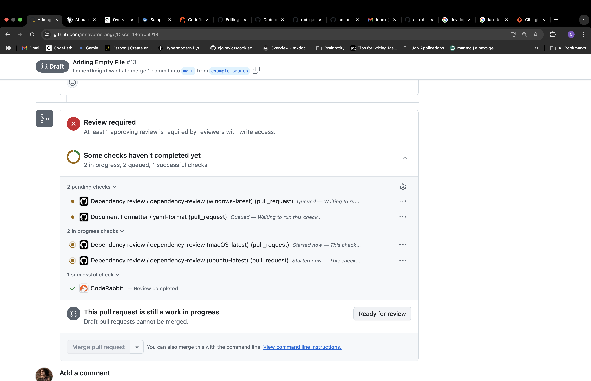

<!-- CONTRIBUTING.md is based on the provided in the Red Queen Repo: https://github.com/Qiskit/red-queen/blob/a9f396b16c88cea9c9987cd379526c0624e22323/CONTRIBUTING.md -->

# Contributing

First read the overall project contributing guidelines. These are all
included in the ReadMe file of this repo:

<https://github.com/innovateorange/DiscordBot/blob/ec161ab7b4d38fab5db17f62c353e9d673e6fbde/README.md>

## Contributing to Discord Bot Project

## Style and lint

Discord Bot Project uses two tools to verify code formatting and lint checking. The
first tool is [black](https://github.com/psf/black) which is a code formatting
tool that will automatically update the code formatting to a consistent style.
The second tool is [ruff](https://github.com/astral-sh/ruff) which is a code linter
which does a deeper analysis of the Python code to find both style issues and
potential bugs and other common issues in Python.

You can check that your local modifications conform to the style rules
by running `nox` which will run `black` and `ruff` to check the local
code formatting and lint. You will need to have [nox](https://github.com/wntrblm/nox)
installed to run this command. You can do this with `pip install -U nox`.

If black returns a code formatting error, you can run `nox -s format` to
automatically update the code formatting to conform to the style. However,
if `ruff` returns any error, you will have to resolve these issues by manually updating your code.

When you want to contribute to the Discord Bot Project, you will need to create a new branch where you will be staging your changes.

### Creating a new branch

You can do this by running the git checkout command:

```bash
git checkout -b <new_branch_name>
```

> [!TIP]
> Note that this command creates a branch base on the branch that you are currently in, so please make sure that you are on the main branch when you are making a new branch.
>
> You can see which branch you are on by using the git branch command:
>
> ```bash
> git branch
> ```

Once you are ready to push your code to the branch that you created, you have to stage the changes.

### Staging your changes

First you need to add all your changes (deltas) to a git. [You can think of this as putting all of your work into an unmarked folder]

```bash
git add -A # This adds all of the files/edits that you have made 
```

After you add your changes to git, you need to sign it with a message [You can think of this as signing the folder with your name so we know whose work is in the folder]:

```bash
git commit -am "<Title of Change>\n <Rationale behind change>" # This command signs your changes
```

> [!TIP] You can think of your commit message as an email where you explain to your team the reasoning behind your changes. You don't need to explain you changes, your deltas are visable for any reviewers. The thought behind your changes should be clearly outlined in your commit.

After you sign your changes, you need to push your changes to your branch's upstream:

For first-time commits to branch:

```bash
git push -u # This command creates an upstream version of your local branch 
```
>[!NOTE]
> The -u flag is important to track the initial tracking history of the branch itself. You're basically telling git: "Hey, from now on, whenever I'm on this branch, I want to link it to this branch on GitHub." Almost like saving contact information on your phone

For subsequent commits to branch:

```bash
git pull # Pulls changes from base repository 
git push # Pushes changes to upstream
```

### Creating a Pull Request Draft

Once you do that you can create a draft pull request on GitHub. You can do this by visting the Pull Request tab within the project repo. There should be a prompt that looks similar to this:


Press the `Compare & pull request` button, then you will be given the option to create a pull request in this screen:


Click the dropdown menu of the `Create pull request` button:


And then create a draft pull request. Now you can see if your changes pass the [CI/CD](https://github.com/innovateorange/DiscordBot/actions) check.

Once your changes pass the checks and you have successfully implemented your changes, you can convert your draft pull request to pull request. You can do this by pressing the `Ready for review` button:



Once you do that you are ready for code review!

### Code Review

Congrats you have made it to the part where you interact with people! Code review is an opportunity for other people to review your changes and offer you feedback. It's important to make sure that you keep an open minded in this process. Receiving feedback can be hard to begin with, but with respectful communicate it offers you a chance to mature as a software engineer.

### CI/CD Jobs

Time to get a bit more technical. CI/CD (Continuous Integration and Continuous Delivery/Development) Jobs are crucial to esnuring that our codebase reamins clean, reliable, and secure. These automated processes help catch formatting issues, typos, and code that doesn't follow our project's conventions before it makes it to our main branch. They also catch any vulnerabilities in our code early.

In this project, we use three main CI/CD jobs to help uphold the principles of defensive software development:

- `python-package.yml`  
This workflow isntalls project dependencies, runs linting tools, and executes our unittests. It's our first line of defense against breaking changes and helps us make sure nothing sneaky slips through when new code is added.  

  >![NOTE]This workflow runs everytime there is a new pull request that is attempting to push to main

- `codeql.yml`  
CodeQL analyzes the codebase for potential security vulnerabilities. It searches for code patterns that could lead to bugs or exploits and helps catch deeper issues that traditional testing might miss.  
  
  >![NOTE]This workflow runs everytime there is a new pull request that is attempting to push to main

- `dependabot.yml`  
Dependabot automatically monitors our dependencies and opens pull requests when updates are available. This helps us stay current with library versions and patch known security issues before they become and issue.

By contributing to this repo, you're also contributing to standard of quality. So, if the CI/CD workflows fails on your pull request don't worry; It's just part of the process to help you (and the rest of the team) write better, more secure code.

> This document will be updated based on the needs of the team
>
> -[Caleb](@Lementknight)
